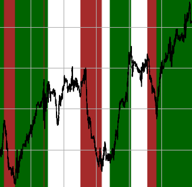
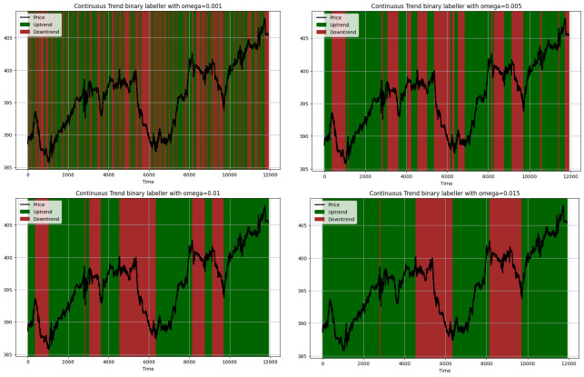
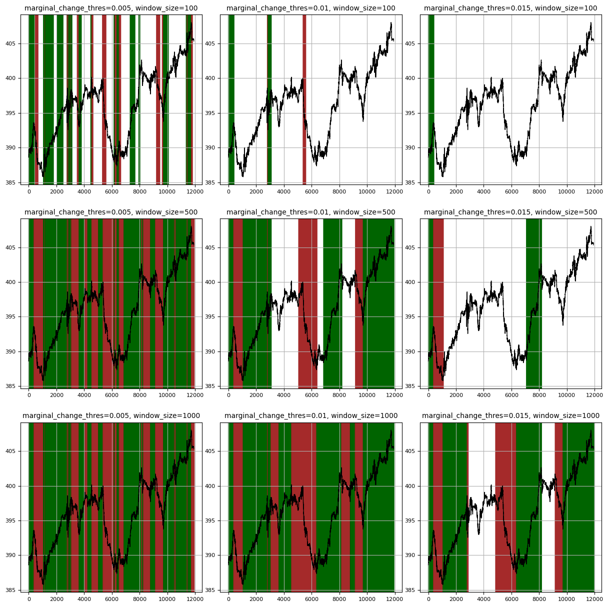
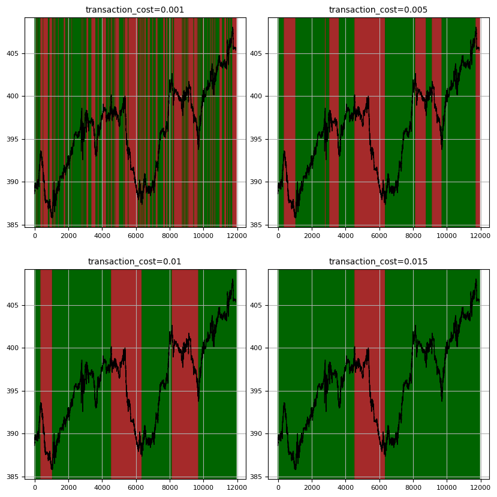
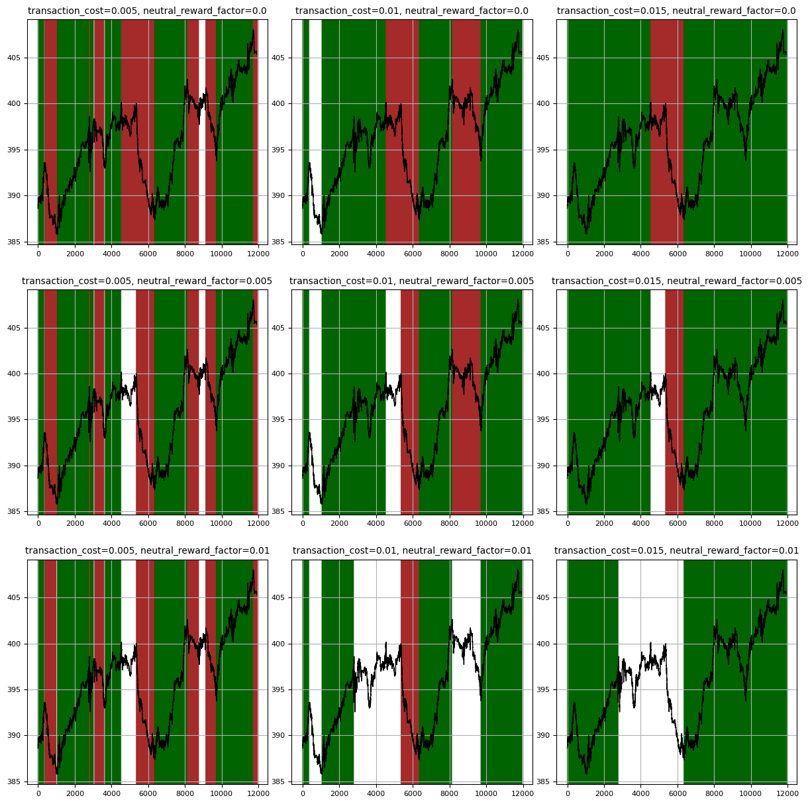

# Python Trend Labeller
[](https://www.python.org/downloads/)
[](https://github.com/psf/black)

<p align="center"></p>

## Introduction

A robust Python package for automated trend labelling in time series data with a strong financial flavour, implementing SOTA trend labelling algorithms ([bibliography](#books-bibliography)) with returns estimation and parameter bayesian optimization capabilities. Main features:
- <ins>**Two-state**</ins> (upwards/downwards) and <ins>**three-state**</ins> (upwards/neutral/downwards) trend labelling algorithms.
- Returns estimation with transaction costs and holding fees.
- Bayesian parameter optimization to select the optimal labelling (powered by [bayesian-optimization](https://github.com/bayesian-optimization/BayesianOptimization)).


## :scroll: Table of Contents
- [Features](#sparkles-features)
- [Installation](#hammer_and_wrench-installation)
- [Quick Start](#rocket-quick-start)
- [Core Components](#nut_and_bolt-core-components)
  - [A) Trend Labellers](#a-trend-labellers)
  - [B) Returns Estimation](#b-returns-estimation)
  - [C) Parameter Optimization](#c-parameter-optimization)
- [Usage Examples](#usage-examples)
- [Roadmap](#construction-roadmap)
- [Contributing](#handshake-contributing)
- [Bibliography](#books-bibliography)
- [License](#scroll-license)


## :sparkles: Features

### Trend Labelling Approaches
- **Continuous Trend Labelling (CTL)**:
  - Binary CTL (Up/Down trends) - Based on [Wu et al.](#books-bibliography)
  - Ternary CTL (Up/Neutral/Down trends) - Inspired by [Dezhkam et al.](#books-bibliography)
- **Oracle Labelling**
  - Binary Oracle (optimizes for maximum returns) - Based on [Kovačević et al.](#books-bibliography)
  - Ternary Oracle (includes neutral state optimization) 

### Returns Estimation
- Simple returns calculation
- Transaction costs consideration
- Holding fees support
- Position-specific fee structures

### Parameter Optimization
- Bayesian optimization for parameter tuning
- Support for multiple time series optimization
- Customizable acquisition functions
- Empirically tested and customizable parameter bounds


## :hammer_and_wrench: Installation

```bash
pip install python-trend-labeller
```

## :rocket: Quick Start

```python
from trend_labelling import BinaryCTL
from returns_estimation import SimpleReturnEstimator
from optimization import Optimizer

# Sample price data
prices = [100.0, 102.0, 105.0, 103.0, 98.0, 97.0, 99.0, 102.0, 104.0]

# 1. Basic naïve CTL Labelling
binary_labeller = BinaryCTL(omega=0.02)
binary_labels = binary_labeller.get_labels(prices)

# 2. Returns Estimation
estimator = SimpleReturnEstimator()
returns = estimator.estimate_return(prices, binary_labels)

# 3. Parameter Optimization
optimizer = Optimizer(
    returns_estimator=SimpleReturnEstimator,
    initial_points=5,
    nb_iter=100
)
optimal_params = optimizer.optimize(BinaryCTL, prices)
print(f"Optimal parameters: {optimal_params['params']}")

# 4. Optimized Labelling
optimal_labeller = BinaryCTL(
    **optimal_params['params']
)
optimal_labels = optimal_labeller.get_labels(prices)
```

## :nut_and_bolt: Core Components

### A) Trend Labellers

See the notebook [labellers_catalogue.ipynb](notebooks/labellers_catalogue.ipynb) for a detailed example of the trend labellers.

#### 1. Labellers based on Continuous Trend Labelling (CTL)
- **BinaryCTL**: Implements the [Wu et al.](#books-bibliography) algorithm for binary trend labelling. When the market rises above a certain proportion parameter <ins>omega</ins> from the current lowest point or recedes from the current highest point to a certain proportion parameter <ins>omega</ins>, the two segments are labeled as rising and falling segments, respectively. 
  - Parameters:
    - `omega`: Threshold for trend changes (float). Key to manage the sensitivity of the labeller.\
    **For instance, for a value of 0.001, 0.005, 0.01, 0.015, the labeller behaves as follows:**
    
    <p align="center"></p>

  
- **TernaryCTL**: Extends CTL with a neutral state. It introduces a window_size parameter to look for trend confirmation before resetting state to neutral, similar to the second loop in the [Dezhkam et al.](#books-bibliography) algorithm.
  - Parameters:
    - `marginal_change_thres`: Threshold for significant time series movements as a percentage of the current value.
    - `window_size`: Maximum window to look for trend confirmation before resetting state to neutral.\
    **For instance, for different combinations of `marginal_change_thres` and `window_size`, the labeller behaves as follows:**

    <p align="center"></p>

#### 2. Labellers based on the Oracle Labeller
- **OracleBinaryTrendLabeller**: Implements the [Kovačević et al.](#books-bibliography) algorithm for binary trend labelling, optimizing labels for maximum returns given a transaction cost parameter. Algorithm complexity is optimized via dynamic programming.
  - Parameters:
    - `transaction_cost`: Cost coefficient for position changes.\
    **For instance, for different values of `transaction_cost`, the labeller behaves as follows:**

    <p align="center"></p>

- **OracleTernaryTrendLabeller**: Extends the binary oracle labeller to include neutral state in optimization. It constrains the switch between upward et downwards trends to go through a neutral state. The reward for staying in a neutral state is managed via a `neutral_reward_factor` parameter.
  - Parameters:
    - `transaction_cost`: Cost coefficient for position changes
    - `neutral_reward_factor`: Coefficient for the reward of staying in a neutral state.\
    **For instance, for different values of `neutral_reward_factor`, the labeller behaves as follows:**

    <p align="center"></p>

### B) Returns Estimation

The package provides flexible returns estimation with transaction costs. It introduces:
- **Returns estimation**, based on the price fluctuations correctly labelled vs incorrectly labelled.
- **Percentage transaction costs**, based on the position changes. It pushes the labeller to identify long term trends.
- **Constant holding fees**, based on the position duration. Useful for ternary labellers to reward the identification of neutral trends.

```python
from returns_estimation import ReturnsEstimatorWithFees, FeesConfig

# Configure fees
fees_config = FeesConfig(
    lp_transaction_fees=0.001,  # 0.1% fee for long positions
    sp_transaction_fees=0.001,  # 0.1% fee for short positions
    lp_holding_fees=0.0001,    # 0.0001 constant fee for long positions
    sp_holding_fees=0.0001     # 0.0001 constant fee for short positions
)

# Create estimator with fees
estimator = ReturnsEstimatorWithFees(fees_config)

# Calculate returns with fees
returns = estimator.estimate_return(prices, labels)
```

### C) Parameter Optimization

The package uses Bayesian optimization to find optimal parameters, optimizing the returns for a given fees/no fees configuration.
By definition this is a bounded optimization problem, and some default bounds are provided for each labeller implementation:
- `BinaryCTL`: `omega` is bounded between 0 and 0.01
- `TernaryCTL`: `marginal_change_thres` is bounded between 0.000001 and 0.1, `window_size` is bounded between 1 and 5000
- `OracleBinaryTrendLabeller`: `transaction_cost` is bounded between 0 and 0.01
- `OracleTernaryTrendLabeller`: `transaction_cost` is bounded between 0 and 0.01, `neutral_reward_factor` is bounded between 0 and 0.1

```python
from optimization import Optimizer, OptimizationBounds

# Create optimizer
optimizer = Optimizer(
    returns_estimator=ReturnsEstimatorWithFees,
    initial_points=10,
    nb_iter=1000,
    # random_state=42
)

# Custom bounds (optional)
bounds = {
    'transaction_cost': (0.0, 0.01),
    'neutral_reward_factor': (0.0, 0.1)
}

# Optimize parameters
result = optimizer.optimize(
    labeller_class=OracleTernaryTrendLabeller,
    time_series_list=prices,
    bounds=bounds,
    # acquisition_function=my_acquisition_function,
    # verbose=2
)

print(f"Optimal parameters: {result['params']}")
print(f"Maximum return: {result['target']}")
```

> [!WARNING]
> The acquisition function is set to UpperConfidenceBound(kappa=2) by default. This is a good default choice that balances exploration and exploitation, but you may want to experiment with other values for kappa or other acquisition functions like bayes_opt.acquisition.ExpectedImprovement() or bayes_opt.acquisition.ProbabilityOfImprovement() for your specific use case.

> [!CAUTION]
> The default bounds are presetted for relatively constant time series and may not be optimal for all use cases. It is recommended to test the waters by testing the labels with some parameters at different orders of magnitude before optimizing. See [optimization example notebook](notebooks/optimization_example.ipynb) for a detailed example of parameter optimization.

## :construction: Roadmap

- [ ] Transform labels into trend momentum / potential.
- [ ] Calculate returns for one subset of labels only.
- [ ] Always good to explore more labellers.

## :handshake: Contributing

Contributions are welcome! Please feel free to submit a Pull Request. For major changes, please open an issue first to discuss what you would like to change.

Please make sure to update tests as appropriate and adhere to the existing coding style.

## :books: Bibliography

The algorithms implemented in this package are based or inspired by the following academic papers:

[1]: #wu-2021 "Wu et al. (2021)"
[2]: #dezhkam-2021 "Dezhkam et al. (2021)"
[3]: #kovacevic-2021 "Kovačević et al. (2021)"

1. <a name="wu-2021"></a>Wu, D., Wang, X., Su, J., Tang, B., & Wu, S. "A Labeling Method for Financial Time Series Prediction Based on Trends". *Referenced in BinaryCTL implementation.*

2. <a name="dezhkam-2021"></a>Dezhkam, A., Moazeni, S., & Moazeni, S. "A Bayesian-based classification framework for financial time series trend prediction". *Referenced in TernaryCTL implementation.*

3. <a name="kovacevic-2021"></a>Kovačević, T., Merćep, A., Begušić, S., & Kostanjčar, Z. "Optimal Trend Labeling in Financial Time Series". *Referenced in Oracle Labellers implementation.*

## :scroll: License

[BSD-2-Clause](LICENSE)